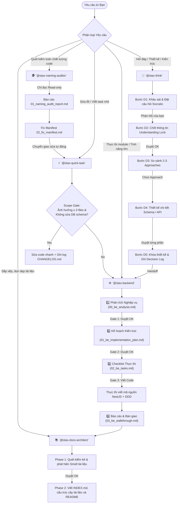

# 🤖 STAX Agentic AI Engine — Cẩm nang Vận hành Kỹ năng

Thư mục `.agent/` chứa toàn bộ các **Skill cấu hình kỹ năng hành vi** chuyên biệt được tối ưu hóa cho vị trí **Senior System Design, Business Analyst (BA), và NestJS Backend DDD/Clean Architecture Architect**.

Tài liệu này là hướng dẫn chuẩn mực giúp bạn và AI phối hợp nhịp nhàng các Agent để xử lý mọi yêu cầu trong dự án theo các quy trình chuyên nghiệp, có chốt chặn kỹ luật chặt chẽ.

---

## 🗺️ Sơ đồ Luồng Phối hợp Tổng thể (Workflow Architecture)

Dưới đây là sơ đồ hóa cách các Skill tự động phân loại, phối hợp và chuyển giao công việc (Handoff) tùy theo loại yêu cầu của bạn:

---

## 🚀 Chi tiết 3 Quy trình Vận hành Chuẩn (Standard Workflows)

### 1. Quy trình Phát triển Tính năng Lớn (Feature Development Workflow)
Áp dụng khi bạn muốn xây dựng một module mới từ đầu (Ví dụ: "Thiết kế và triển khai module Tính lương").

1.  **Bước 1 - Lên ý tưởng & Chốt kiến trúc:**
    *   Gọi **`@stax-think`** để AI brainstorm giải pháp.
    *   AI sẽ đặt các câu hỏi Socratic để hiểu rõ **Mục đích, Context, Constraints, và Non-goals**.
    *   Sau khi thống nhất, AI khóa thiết kế bằng **Decision Log** và sẵn sàng bàn giao.
2.  **Bước 2 - Lập kế hoạch & Triển khai Backend:**
    *   Gọi **`@stax-backend`** để bắt đầu viết code NestJS + Drizzle + DDD.
    *   AI bắt buộc phải đi qua 3 cổng chặn nghiêm ngặt (Phân tích $\to$ Kế hoạch $\to$ Checklist) trước khi viết dòng code đầu tiên. Bạn gõ `OK` để duyệt qua từng bước.
    *   Sau khi code xong và chạy tests thành công, AI xuất file Bàn giao `03_be_walkthrough.md`.
3.  **Bước 3 - Cập nhật cây tài liệu:**
    *   Gọi **`@stax-docs-architect`** để cập nhật tài liệu thiết kế mới vào `docs/README.md` và `docs/history/INDEX.md` để các AI khác trong tương lai kế thừa.

---

### 2. Quy trình Sửa lỗi & Vá nhanh (Quick Patch Workflow)
Áp dụng khi bạn muốn sửa một bug nhỏ hoặc thêm một trường thông tin đơn giản.

1.  **Bước 1 - Gọi nhanh:**
    *   Gọi **`@stax-quick-task`** và cung cấp yêu cầu.
2.  **Bước 2 - Kiểm tra Cổng Scope Gate:**
    *   AI rà soát mã nguồn. Nếu phát hiện thay đổi chạm vào **nhiều hơn 3 files** hoặc phải **thay đổi cấu trúc Database schema**, AI sẽ tự động từ chối và yêu cầu bạn chuyển sang gọi `@stax-backend` để đảm bảo an toàn kiến trúc.
3.  **Bước 3 - Thực thi & Ghi Log:**
    *   AI tiến hành viết code nhanh, đảm bảo 0 lỗi TypeScript `any` và không vi phạm "Domain Purity".
    *   Sau khi hoàn tất, AI ghi nhận thay đổi trực tiếp lên đầu tệp `docs/STAX/06_CHANGELOG.md`.

---

### 3. Quy trình Kiểm soát Chất lượng Code (Quality Assurance Workflow)
Áp dụng khi bạn muốn quét toàn bộ codebase để tìm "nợ kỹ thuật" (Technical Debt) hoặc vi phạm quy tắc đặt tên.

1.  **Bước 1 - Quét kiểm toán:**
    *   Gọi **`@stax-naming-auditor`**.
    *   AI hoạt động ở chế độ **Chỉ Đọc (Read-only)**, tuyệt đối không chỉnh sửa mã nguồn của bạn. Nó quét các files theo từ điển Ubiquitous Language và phát hiện các rò rỉ dữ liệu (như lộ mật khẩu trong DTO).
2.  **Bước 2 - Xuất báo cáo kiểm toán:**
    *   AI tạo thư mục `docs/audits/YYYYMMDD_{module_name}/` chứa báo cáo lỗi chi tiết (`01_...`) và danh sách hành động sửa lỗi (`02_fix_manifest.md`).
3.  **Bước 3 - Tự động sửa chữa:**
    *   Bạn gọi **`@stax-quick-task`** và yêu cầu: *"Thực thi sửa lỗi tự động dựa trên file 02_fix_manifest.md"*.
    *   AI sẽ đọc manifest và tự động thực thi sửa lỗi nhanh chóng, chính xác.

---

## ⌨️ Cú pháp lệnh gọi nhanh (Shortcuts & Commands)

Bạn chỉ cần gõ các câu lệnh sau trong chat, AI sẽ ngay lập tức kích hoạt đúng Persona và Skill tương ứng:

*   **Để thiết kế / brainstorm:**
    > *"Hãy dùng @stax-think để thiết kế giải pháp cho [yêu cầu] của tôi."*
*   **Để code module mới:**
    > *"Hãy dùng @stax-backend để bắt đầu lập kế hoạch triển khai [yêu cầu]."*
*   **Để sửa nhanh / vá lỗi:**
    > *"Hãy dùng @stax-quick-task để sửa lỗi [yêu cầu]."*
*   **Để quét kiểm toán chất lượng code:**
    > *"Hãy dùng @stax-naming-auditor để quét toàn bộ module [tên-module]."*
*   **Để cấu trúc lại tài liệu:**
    > *"Hãy dùng @stax-docs-architect để dọn dẹp thư mục docs."*
