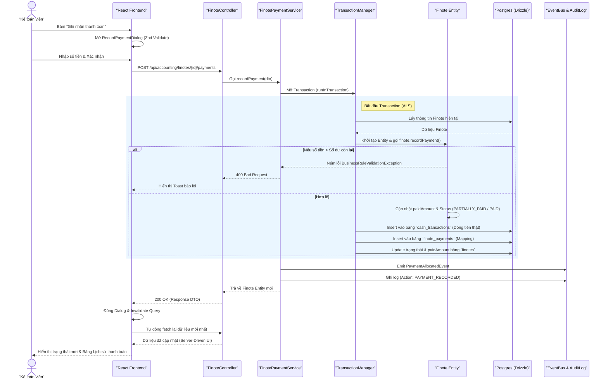
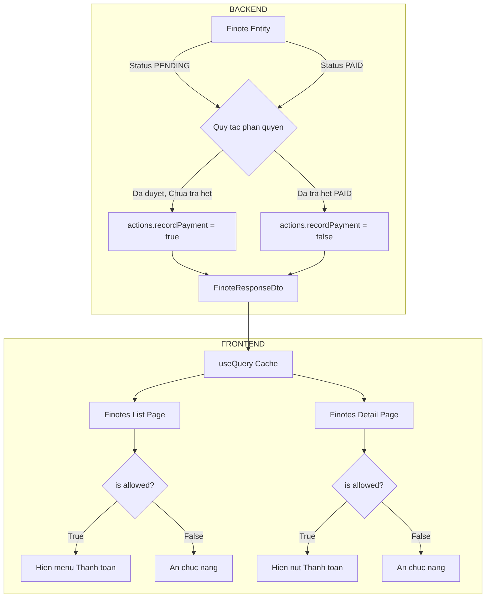
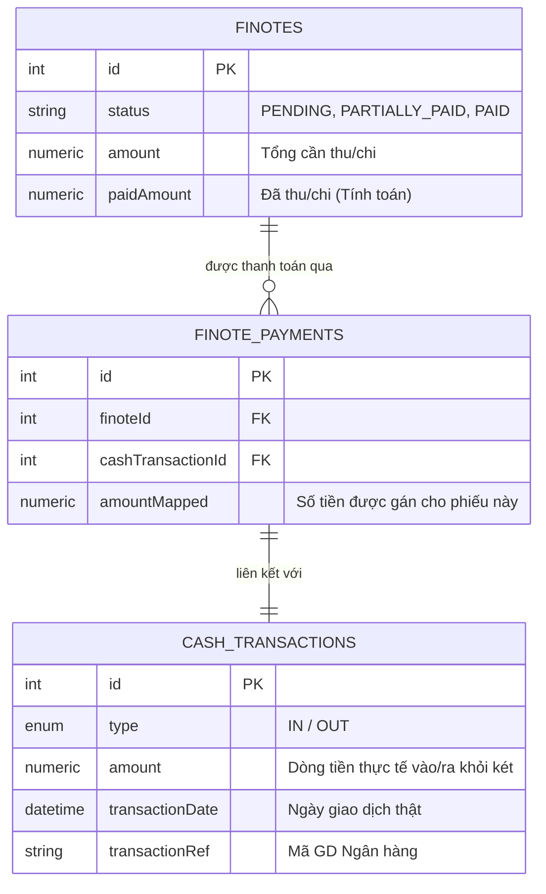

# Quy trình hoạt động (Workflow): Ghi nhận thanh toán Finote

Dưới đây là sơ đồ hóa toàn bộ kiến trúc và luồng dữ liệu (Data Flow) của tính năng **Ghi nhận thanh toán (Record Finote Payment)** mà chúng ta vừa triển khai, bao quát từ giao diện người dùng (Frontend) xuống đến cơ sở dữ liệu (Backend).

## 1. Sequence Diagram (Luồng tương tác hệ thống)

Sơ đồ này mô tả tuần tự các bước xảy ra từ khi Kế toán viên bấm nút "Thanh toán" cho đến khi giao diện cập nhật.

---

## 2. Server-Driven UI (Kiểm soát giao diện từ Server)

Kiến trúc UI được thiết kế để không chứa logic cứng về nghiệp vụ, mà hoàn toàn dựa vào `_actions` từ backend trả về thông qua **Contract**.

---

## 3. Cấu trúc Database (Rich Domain Model)

Mỗi lần thanh toán được ghi nhận, hệ thống lưu vết toàn diện để phục vụ đối soát (Reconciliation) sau này.

