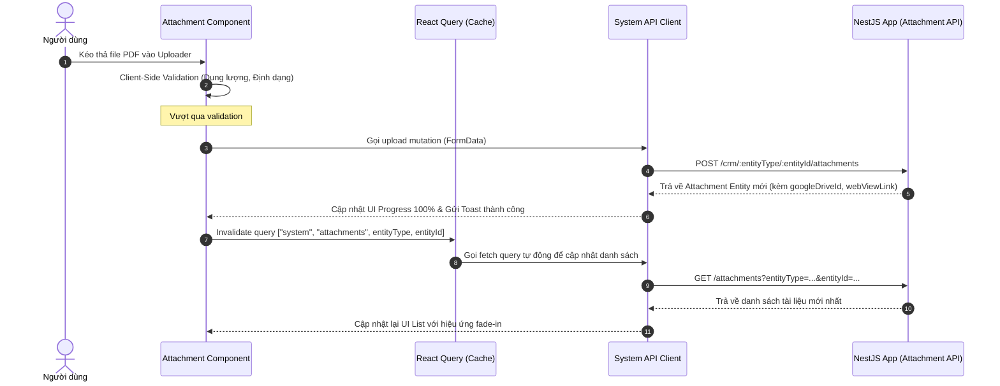

# Phân tích UI/UX - Hệ thống Quản lý Tài liệu đính kèm (Attachments)

> Context Folder: `docs/context/20260520_attachment_management/`
> Tệp phân tích: `00_fe_analysis.md`

## 1. Mục tiêu UI/UX (UX Objectives)
Mục tiêu là mang lại một trải nghiệm tải lên và quản lý tài liệu cao cấp, mượt mà, đậm chất premium và cực kỳ trực quan cho các module CRM (Doanh nghiệp/Client, Hợp đồng/Contract, Báo giá/Quote).

- **Wow Factor**: 
  - Vùng kéo thả (Drag-and-Drop zone) đẹp mắt với hiệu ứng Hover/Focus tinh tế, bo góc mềm mại, đổ bóng nhẹ.
  - Trạng thái Uploading hiển thị Progress Bar mượt mà, các icon sinh động (PDF, Word, Excel, Image) tự động phân biệt định dạng file.
  - Micro-animations sử dụng `framer-motion` cho các hành động thêm mới/xóa tài liệu đính kèm.
- **Tính năng cốt lõi**:
  - **Premium Drag & Drop Uploader**: Hỗ trợ kéo thả file, validate dung lượng (tối đa 20MB) và loại file ngay tại Client (PDF, Docx, Xlsx, CSV, PNG, JPG, WebP) kèm theo thông báo Toast trực quan.
  - **Dynamic Categorization & Tags**: Cho phép lựa chọn phân loại tài liệu (Hợp đồng, Hóa đơn, Báo giá, Tài liệu nhân sự...) và gắn nhãn (Tags) tùy biến trước khi tải lên.
  - **Embedded Attachment Board**: Một widget danh sách tài liệu dùng chung cực kỳ gọn gàng hiển thị: Tên file, Dung lượng, Danh mục (Category) có màu sắc phân biệt, Người tải lên, Ngày tải và nút tải về/xóa nhanh.
- **Responsive Layout**:
  - Tự động chuyển đổi hiển thị: Dạng danh sách gọn gàng (Table/DataGrid) trên Desktop và dạng thẻ (Grid of Cards) trên Mobile để dễ tương tác bằng cảm ứng.
  - Hộp thoại Modal upload tự co giãn rộng `w-[95vw]` trên Mobile, hạn chế chiều cao tối đa `max-h-[90vh] overflow-y-auto` để chống tràn màn hình.

---

## 2. Luồng Dữ liệu Dự kiến (FE Data Flow)
Ứng dụng sử dụng React Query (`@tanstack/react-query`) làm trung tâm quản lý State, đảm bảo không lưu trữ trạng thái bất đồng bộ vào Zustand và tự động Invalidate cache sau khi thêm/xóa file.

---

## 3. Server-Driven UI Logic & Permissions
Tuân thủ nghiêm ngặt hiến pháp STAX:
- Chỉ hiển thị nút **Xóa (Delete)** tài liệu nếu người dùng có quyền xóa dựa trên logic Client-side (Người tải lên là `currentUser.id` HOẶC tài khoản có vai trò `ADMIN`/`SUPER_ADMIN`).
- Các hành động tải lên (`Upload`) sẽ bị ẩn hoặc vô hiệu hóa nếu thực thể cha (ví dụ: Hợp đồng đã bị hủy bỏ `CANCELLED` hoặc Lead đã bị đóng) không cho phép cập nhật, bảo vệ tính toàn vẹn của dữ liệu theo logic trạng thái thực thể.

---

## 4. Tích hợp màn hình thực tế (Layout Integration)
Tôi sẽ tích hợp tính năng này vào 3 màn hình lớn hiện có:
1. **Client Detail (`client-detail.tsx`)**: Thay thế tab placeholder "Tài liệu" bằng widget `AttachmentList` dùng chung để tải và quản lý hồ sơ đăng ký kinh doanh, báo cáo tài chính của doanh nghiệp.
2. **Contract Detail (`contract-detail.tsx`)**: Tích hợp trực tiếp vào tab "Xem File PDF" và phần chi tiết để thay thế nút placeholder "Tải lên bản PDF mới", hỗ trợ lưu trữ nhiều phiên bản phụ lục hợp đồng đính kèm.
3. **Lead Detail (`lead-detail.tsx`)**: Tích hợp phần tải tài liệu đính kèm vào dưới tab Báo giá (Quotes) hoặc thêm tab Tài liệu đính kèm cho Lead để lưu giữ bằng chứng giao dịch và tài liệu liên quan đến Lead đó.

---

Vui lòng gõ **'OK'** để tôi tiến hành thiết kế kiến trúc FE.
