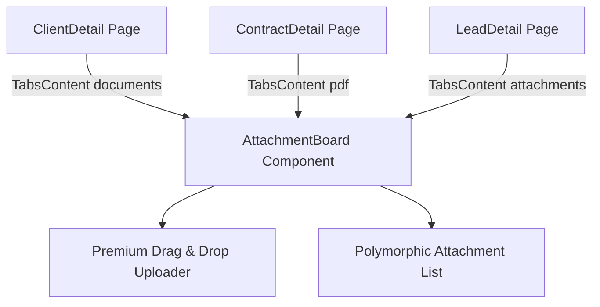

# Kế hoạch Kiến trúc Frontend - Hệ thống Quản lý Tài liệu đính kèm (Attachments)

> Context Folder: `docs/context/20260520_attachment_management/`
> Tệp thiết kế: `01_fe_implementation_plan.md`

## 1. Đồng bộ Contracts (Contract Sync)
Sử dụng các kiểu dữ liệu và Zod Schema đã được đồng bộ tự động từ Backend sang `frontend/shared/contracts/system.ts`:
- **`Attachment`**: Interface mô tả thông tin file đính kèm (id, fileName, category, webViewLink, downloadLink, mimeType, fileSize, uploadedById, createdAt...).
- **`AttachmentCategory`**: Enum các loại danh mục (`contract_doc`, `invoice`, `quote_doc`, `hr_document`, `evidence`, `image`, `report`, `other`).
- **`AttachmentListResponse`**: Định dạng danh sách trả về gồm mảng `items` và bản đồ gom nhóm `groupedByCategory`.
- **`attachmentUploadSchema`**: Schema Zod dùng để validate danh mục (category) và thẻ nhãn (tags) tại phía Client.

---

## 2. Thiết lập API Client (React Query Hooks)
Chúng ta sẽ bổ sung các API calls và React Query hooks tập trung tại module `system` để quản lý trạng thái tải/xóa/hiển thị tài liệu đính kèm.

### A. API Methods (`frontend/client/src/modules/system/api/system.api.ts`)
```typescript
export const systemApi = {
  // ... audit logs cũ ...

  getAttachments: (params?: { organizationId?: number; entityType?: string; entityId?: number }) =>
    apiRequest<AttachmentListResponse>("GET", withQuery("/attachments", params)),

  uploadAttachment: (entityType: string, entityId: number, data: FormData) => {
    // Map 'client' sang 'organizations' ở backend, các thực thể khác thêm chữ 's'
    const pluralType = entityType === 'client' ? 'organizations' : `${entityType}s`;
    return apiRequest<Attachment>("POST", `/crm/${pluralType}/${entityId}/attachments`, data);
  },

  deleteAttachment: (id: number) =>
    apiRequest<void>("DELETE", `/attachments/${id}`),
};
```

### B. React Query Hooks (`frontend/client/src/modules/system/hooks/useAttachments.ts`)
Chúng ta sẽ viết custom hooks tách biệt phần logic:
- **`useAttachments(params)`**: Query lấy danh sách file kèm trạng thái `isLoading`, `error`.
- **`useUploadAttachment()`**: Mutation upload file (sử dụng FormData), tự động `invalidateQueries` sau khi upload thành công.
- **`useDeleteAttachment()`**: Mutation xóa file, tự động `invalidateQueries` sau khi xóa thành công và thông báo Toast.

---

## 3. Cấu trúc Component Tree
Thiết kế các Component tái sử dụng cao, áp dụng các quy chuẩn thiết kế premium của STAX:



### A. `FileUploader.tsx` (Premium Drag & Drop Uploader)
- **Props**: `entityType: string`, `entityId: number`, `onSuccess?: () => void`.
- **UI & State**:
  - Hộp kéo thả bo viền dashed, hover đổi background xanh dịu.
  - Sử dụng React Hook Form và `zodResolver` để quản lý form metadata (`category`, `tags`).
  - Hiển thị danh mục tài liệu trực quan (Select dropdown với các Categories được format sang Tiếng Việt dễ hiểu).
  - Thanh tiến trình tải lên (Progress bar) khi mutation `isPending`.

### B. `AttachmentList.tsx` (Embedded Attachment List)
- **Props**: `attachments: Attachment[]`, `isLoading: boolean`, `onDelete: (id: number) => void`.
- **UI & State**:
  - 3-State Rule: Xử lý hiển thị `Skeleton` khi loading, `EmptyState` khi không có file, và `Toast` khi xóa.
  - Tự động hiển thị Icon file phù hợp dựa trên `mimeType` (ví dụ: `FileText` cho PDF/Word, `FileWarning` cho lỗi, `ImageIcon` cho PNG/JPG...).
  - Badge màu sắc khác nhau cho từng `category` (ví dụ: `contract_doc` màu lục, `quote_doc` màu cam, `invoice` màu lam...).
  - Kiểm tra quyền xóa: nút Delete chỉ khả dụng nếu `currentUser.id === uploadedById` hoặc người dùng là `ADMIN`.

---

## 4. State Management
- Trạng thái bất đồng bộ (Asynchronous State) như dữ liệu danh sách tài liệu và trạng thái Mutations hoàn toàn do **React Query** quản lý qua `queryClient`.
- Không sử dụng Zustand cho việc lưu trữ mảng file đính kèm.
- Toast (`useToast()`) dùng để phản hồi lập tức cho người dùng về trạng thái upload/xóa thành công hoặc thất bại.

---

Thiết kế này đã chuẩn chưa? Nếu OK, tôi sẽ xuất Checklist.
