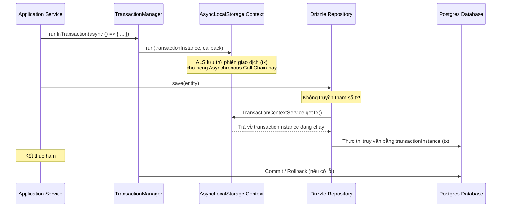

# ADR-0002 — Implicit Transaction Propagation using AsyncLocalStorage (ALS)

- Status: Accepted
- Date: 2026-05-18
- Author: Antigravity AI & STAX Team
- Related: `backend/src/core/shared/infrastructure/persistence/transaction-manager.service.ts`

## 1. Context (Bối cảnh)

Trong các dự án NestJS + Drizzle/SQL thông thường, khi thực hiện một chuỗi thao tác ghi DB trong cùng một Business Transaction (Ủy thác nguyên tử), lập trình viên thường phải truyền thực thể transaction (`tx` hoặc `client`) thủ công qua tất cả các lớp:
```typescript
// ❌ ANTI-PATTERN (Manually passing tx)
await this.txManager.runInTransaction(async (tx) => {
    await this.userRepo.save(user, tx);
    await this.auditLogRepo.log(action, tx);
});
```

Điều này dẫn đến nhiều vấn đề nghiêm trọng:
1. **Vi phạm Clean Architecture:** Tầng Application Services bị ô nhiễm bởi các đối tượng kỹ thuật (`tx` của Drizzle/PG) thuộc lớp Infrastructure.
2. **Boilerplate phình to:** Mọi phương thức Repository đều phải thêm tham số optional `tx?: any` và code kiểm tra `const db = tx || this.db`.
3. **Dễ gây lỗi bất đồng bộ:** Developer chỉ cần quên truyền `tx` vào một phương thức repo ở giữa luồng là bước đó sẽ chạy ngoài Transaction, gây mất mát dữ liệu hoặc inconsistent state nếu xảy ra rollback.

## 2. Decision (Quyết định kiến trúc)

STAX áp dụng cơ chế **Implicit Transaction Propagation (Lan truyền Transaction Ngầm)** sử dụng **AsyncLocalStorage (ALS)** của Node.js. 

*   Mọi phương thức cần chạy trong Transaction chỉ cần bọc trong `ITransactionManager.runInTransaction(async () => { ... })`.
*   **TUYỆT ĐỐI KHÔNG** truyền tham số `tx` vào callback của `runInTransaction`.
*   **TUYỆT ĐỐI KHÔNG** truyền tham số `tx` vào các hàm của Repository.
*   Repository sẽ tự động nhận biết và sử dụng transaction hiện tại thông qua `AsyncLocalStorage` context.

---

## 3. How It Works (Nguyên lý hoạt động)

Hệ thống hoạt động dựa trên 3 trụ cột chính:



1.  **`TransactionManager` thiết lập Context:**
    Khi `runInTransaction` được gọi, nó tạo ra một transaction mới thông qua Drizzle DB client, sau đó đẩy thực thể transaction này vào `AsyncLocalStorage` và thực thi callback nghiệp vụ bên trong vùng lưu trữ đó.
2.  **`TransactionContextService` lấy Context:**
    Tự động truy xuất thực thể transaction `tx` hiện tại từ ALS:
    ```typescript
    const tx = TransactionContextService.getTx();
    ```
3.  **`DrizzleBaseRepository` tự động ánh xạ:**
    Mọi repository kế thừa từ `DrizzleBaseRepository` đều thừa hưởng phương thức `getDb()`:
    ```typescript
    protected getDb(): NodePgDatabase<typeof schema> {
      const tx = TransactionContextService.getTx();
      return tx ? (tx as unknown as NodePgDatabase<typeof schema>) : this.db;
    }
    ```
    Nếu ứng dụng đang chạy trong context của một `runInTransaction`, `getDb()` sẽ trả về đối tượng Transaction (`tx`). Ngược lại, nó trả về kết nối DB thường (`this.db`).

---

## 4. Guidelines for Developers & Agentic AIs (Cẩm nang bắt buộc)

### 🚨 NGUYÊN TẮC VÀNG (MUST DO)

1.  **Chữ ký callback của `runInTransaction` PHẢI có 0 đối số:**
    *   **ĐÚNG (DO THIS):** `this.txManager.runInTransaction(async () => { ... })`
    *   **SAI (NOT THAT):** `this.txManager.runInTransaction(async (tx) => { ... })` *(Sẽ gây lỗi compile TypeScript vì kiểu callback yêu cầu `() => Promise<T>`)*
2.  **Không khai báo tham số `tx` trong Repository Methods:**
    *   **ĐÚNG (DO THIS):** `async save(fund: CashFund): Promise<CashFund>`
    *   **SAI (NOT THAT):** `async save(fund: CashFund, tx?: any): Promise<CashFund>`
3.  **Bên trong Repository, luôn sử dụng `this.getDb()`:**
    *   **ĐÚNG (DO THIS):**
        ```typescript
        const db = this.getDb();
        await db.insert(schema.cashFunds).values(data);
        ```

---

## 5. Consequences (Hệ quả)

### Tích cực (Positives)
*   **Code sạch tối đa:** Tầng Service hoàn toàn tập trung vào logic nghiệp vụ của doanh nghiệp (Pure Domain/Application), hoàn toàn không chứa bất kỳ mã hạ tầng nào liên quan đến PG/Drizzle transaction.
*   **An toàn tuyệt đối:** Tránh hoàn toàn lỗi do "quên truyền tx". Mọi tác vụ DB phát sinh trong chuỗi async call của service bọc bởi `runInTransaction` đều tự động chạy chung một transaction.
*   **Dễ viết Unit Test:** Không cần giả lập (mock) tham số `tx` phức tạp trong các file test.

### Hạn chế (Trade-offs)
*   Đồ hỏi nhà phát triển mới hoặc AI Agent mới tham gia dự án phải đọc tài liệu này để tránh viết code theo thói quen cũ (truyền `tx` thủ công).
