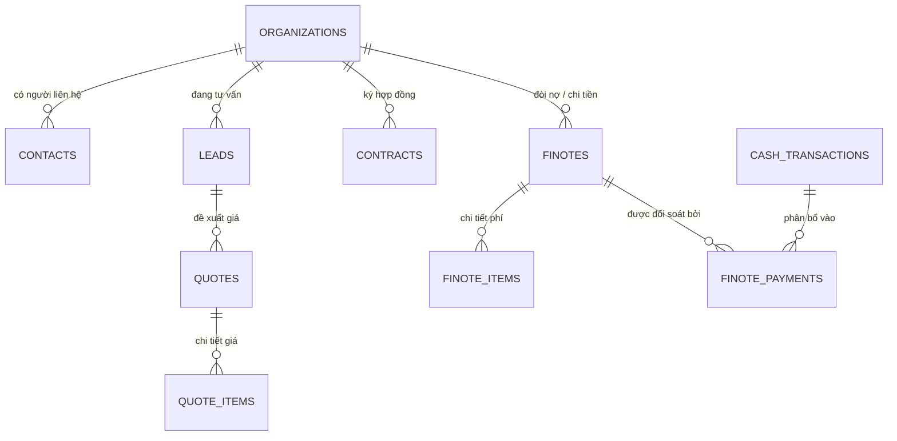

# 🏗️ Kiến trúc tổng thể (STAX Architecture Overview)

Hệ thống STAX được thiết kế theo mô hình **Modular Monolith** chuẩn mực, sẵn sàng bóc tách thành Microservices khi cần. Kiến trúc cốt lõi dựa trên 3 trụ cột: **Clean Architecture**, **Domain-Driven Design (DDD)**, và **Multi-tenant Data Isolation**.

## 1. Hệ thống phân tầng (Tiered System)

Để quản lý độ phức tạp và ngăn chặn phụ thuộc vòng (Circular Dependency), STAX phân cấp các module theo "độ sâu" nghiệp vụ:

| Cấp độ | Tên | Đặc điểm | Ví dụ |
| :--- | :--- | :--- | :--- |
| **Tier 1** | **Foundation** | Hạ tầng dùng chung, không chứa logic nghiệp vụ. | `Rbac`, `Notification`, `AuditLog`, `Storage` |
| **Tier 2** | **Domain Core** | Nguồn sự thật (DNA) và vận hành xương sống. | `User`, `OrgStructure`, `Employee` |
| **Tier 3** | **Process Flow** | Dòng chảy nghiệp vụ và tiền bạc (Flow). Phụ thuộc Tier 2. | `CRM`, `Accounting`, `Contracts` |

> [!IMPORTANT]
> **Nguyên tắc Cô lập:** Tier 2 KHÔNG được phụ thuộc vào Tier 3. Giao tiếp chéo module (Cross-module) phải thông qua **Ports (Interfaces)** hoặc **Domain Events (EventBus)**.

## 2. Triết lý thiết kế cốt lõi

1.  **Organization-Centric:** Bảng `Organizations` là "Mặt trời" của hệ thống. Mọi dữ liệu (HRM, CRM, Accounting) đều được neo vào một Organization ID.
2.  **Entity-Process Separation:** Tách biệt Thực thể bền vững (Organizations, Contacts) và Tiến trình nghiệp vụ (Leads, Contracts, Finotes).
3.  **Tách biệt Giao diện và Lõi:** Giao diện dùng thuật ngữ thân thiện, Database lõi quy về chuẩn duy nhất (Single-Table Design) để tối ưu thống kê.

## 3. Sơ đồ thực thể (Omnichannel ERD)

## 4. Lộ trình thực thi (Roadmap)

### Phase 1: Core Foundation (100% Done)
- [x] Clean Architecture Refactor.
- [x] Audit Log System.
- [x] Legacy Data Migration (1000+ leads, 300+ finotes).
- [x] Unit Testing foundation.

### Phase 2: Operational Intelligence (In Progress)
- [x] Omnichannel Activity Feed.
- [x] Real-time Business Intelligence (Bootstrap).
- [/] Unified Onboarding (Contract -> Task).
- [ ] AI-Powered Parsing (Chat/Email to Form).

### Phase 3: Financial Ops & Strategic Reporting
- [ ] Automated Billing.
- [ ] Master Dashboard (Cashflow ROI).
