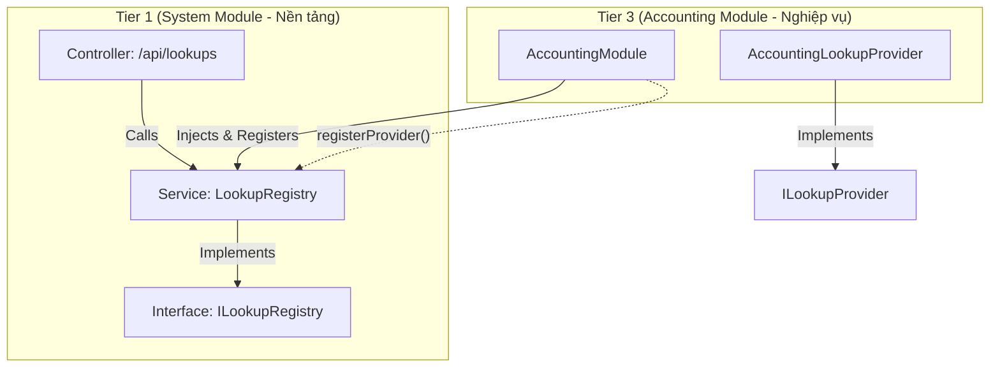

# STAX Architecture Guide: Dynamic Registration (Registry Pattern)
## Phòng chống Vòng lặp Phụ thuộc (Circular Dependency Prevention)

Tài liệu này mô tả chi tiết giải pháp thiết kế **Dynamic Registration (Registry Pattern)** được áp dụng tại dự án STAX. Đây là một khuôn mẫu kiến trúc cốt lõi giúp loại bỏ hoàn toàn sự phụ thuộc vòng (Circular Dependencies) giữa các Module nền tảng (Foundation T1) và Module nghiệp vụ (Business T3), bảo vệ tính cô lập và khả năng mở rộng liên tục của hệ thống NestJS.

---

## 1. Bối cảnh & Vấn đề (The Problem)

Trong kiến trúc phân tầng kiểu STAX:
*   **Tier 1 & 2 (Foundation & Core - Ví dụ: `SystemModule`):** Đóng vai trò là hệ thống lõi cung cấp dịch vụ hạ tầng như cấu hình, cấp phép và tra cứu danh mục dùng chung (Lookups) cho Frontend.
*   **Tier 3 (Process Flow - Ví dụ: `CrmModule`, `AccountingModule`):** Đóng vai trò thực thi luồng nghiệp vụ thực tế và quản trị dữ liệu thực thể nghiệp vụ.

### Kịch bản lỗi phụ thuộc chéo vòng lặp (Circular Dependency)
Khi xây dựng giao diện, Frontend cần một API thống nhất `/api/lookups` để tải toàn bộ danh mục dropdown (ví dụ: danh sách vị trí từ CRM, danh sách tài khoản ngân hàng từ Accounting). 

Nếu thiết kế theo cách thông thường:
1.  **Chiều nghiệp vụ gọi nền tảng:** `AccountingModule` cần kiểm tra quyền và cấu hình hệ thống từ `SystemModule` ➡️ `AccountingModule` import `SystemModule`.
2.  **Chiều nền tảng gọi nghiệp vụ:** `SystemModule` muốn tổng hợp danh mục hiển thị từ phía Accounting ➡️ `SystemModule` phải import `AccountingModule`.

```
🚨 [SystemModule] <─────── (Imports) ───────> [AccountingModule] 🚨
```

**Hậu quả:** NestJS sẽ ném lỗi sập container khi khởi chạy do không thể phân giải thứ tự khởi tạo các Dependency của hai module này (`Circular dependency detected`).

---

## 2. Giải pháp: Đăng ký động & Đảo ngược phụ thuộc (The Solution)

STAX sử dụng mô hình **Registry Pattern (Đăng ký động)**. Thay vì `SystemModule` chủ động đi tìm kiếm và import các Module nghiệp vụ khác, nó sẽ mở ra một **"Ổ cắm rỗng" (Port)**. Các Module nghiệp vụ khi khởi chạy sẽ tự động mang các **"Phích cắm" (Adapter)** của mình cắm vào hệ thống trung tâm đó.

### Sơ đồ luồng hoạt động (Mermaid)



---

## 3. Chi tiết Mã nguồn Ví dụ (Implementation & Examples)

Giải pháp gồm 4 thành phần chính được phân bổ trên các phân tầng ranh giới khác nhau:

### 3.1. Định nghĩa Giao diện (Port) - nằm tại `SystemModule` (T1)
`SystemModule` định nghĩa hợp đồng giao tiếp chung cho tất cả các bên muốn cung cấp dữ liệu tra cứu danh mục.

```typescript
// src/modules/system/domain/ports/lookup-provider.interface.ts
export interface ILookupProvider {
    /**
     * Trả về định danh duy nhất của danh mục này (ví dụ: 'crm', 'accounting')
     */
    getLookupKey(): string;

    /**
     * Thực thi truy vấn lấy dữ liệu tương ứng với tổ chức (tenant)
     */
    getLookupData(tenantId?: number): Promise<any>;
}
```

```typescript
// src/modules/system/domain/ports/lookup-registry.interface.ts
import { ILookupProvider } from './lookup-provider.interface';

export const ILookupRegistry = Symbol('ILookupRegistry');

export interface ILookupRegistry {
    registerProvider(provider: ILookupProvider): void;
    getLookupData(key: string, tenantId: number): Promise<any>;
    getAllLookups(tenantId?: number): Promise<any>;
}
```

### 3.2. Triển khai Dịch vụ Đăng ký trung tâm (Registry Adapter) - nằm tại `SystemModule` (T1)
Đây là container trung gian lưu trữ danh sách các provider động trên bộ nhớ RAM.

```typescript
// src/modules/system/infrastructure/services/lookup-registry.service.ts
import { Injectable, Logger } from '@nestjs/common';
import { ILookupRegistry } from '../../domain/ports/lookup-registry.interface';
import { ILookupProvider } from '../../domain/ports/lookup-provider.interface';
import { BusinessRuleValidationException } from '@core/shared/domain/exceptions/base.exceptions';

@Injectable()
export class LookupRegistry implements ILookupRegistry {
    private readonly logger = new Logger(LookupRegistry.name);
    private readonly providers = new Map<string, ILookupProvider>();

    // Các module khác sẽ gọi hàm này để đăng ký phích cắm
    registerProvider(provider: ILookupProvider): void {
        const key = provider.getLookupKey();
        if (this.providers.has(key)) {
            throw new BusinessRuleValidationException(`LookupProvider cho key "${key}" đã được đăng ký!`);
        }
        this.providers.set(key, provider);
        this.logger.log(`[STAX REGISTRY] Đã đăng ký LookupProvider thành công cho phân hệ: ${key}`);
    }

    // Lấy dữ liệu của 1 key cụ thể
    async getLookupData(key: string, tenantId: number): Promise<any> {
        const provider = this.providers.get(key);
        if (!provider) return [];

        try {
            return await provider.getLookupData(tenantId);
        } catch (error) {
            this.logger.error(`Lỗi khi lấy dữ liệu cho key "${key}":`, error);
            return []; // Cách ly lỗi (Fault Tolerance)
        }
    }

    // Gom dữ liệu của tất cả các key đang có trong Registry
    async getAllLookups(tenantId?: number): Promise<any> {
        let result = {};
        for (const [key, provider] of this.providers) {
            try {
                const data = await provider.getLookupData(tenantId);
                result = { ...result, ...data };
            } catch (error) {
                this.logger.error(`Lỗi gom cụm dữ liệu tại key "${key}":`, error);
            }
        }
        return result;
    }
}
```

### 3.3. Hiện thực hóa "Phích cắm" tại Module Nghiệp vụ - nằm tại `AccountingModule` (T3)
`AccountingModule` viết một lớp Provider tuân thủ đúng giao diện `ILookupProvider`.

```typescript
// src/modules/accounting/application/providers/accounting-lookup.provider.ts
import { Injectable, Inject } from '@nestjs/common';
import { ILookupProvider } from '@modules/system/domain/ports/lookup-provider.interface';
import { ICashFundRepository } from '../../domain/repositories/cash-fund.repository';

@Injectable()
export class AccountingLookupProvider implements ILookupProvider {
    constructor(
        @Inject(ICashFundRepository) private readonly fundRepo: ICashFundRepository,
    ) {}

    getLookupKey(): string {
        return 'accounting';
    }

    async getLookupData(tenantId?: number): Promise<any> {
        // Lấy danh sách quỹ tiền mặt thuộc tổ chức này để làm danh mục
        const activeFunds = await this.fundRepo.findAllActive(tenantId);
        
        return {
            cashFunds: activeFunds.map(fund => ({
                value: fund.id,
                label: `${fund.name} (${fund.code})`,
            }))
        };
    }
}
```

### 3.4. Kích hoạt Đăng ký tự động lúc khởi tạo (Bootstrap Phase)
Ở bước cuối cùng, tại tệp cấu hình **Module nghiệp vụ**, chúng ta implements interface `OnModuleInit` của NestJS để tự động tiêm Registry Service vào và kích hoạt đăng ký.

```typescript
// src/modules/accounting/accounting.module.ts
import { Module, OnModuleInit, Inject } from '@nestjs/common';
import { ILookupRegistry } from '@modules/system/domain/ports/lookup-registry.interface';
import { AccountingLookupProvider } from './application/providers/accounting-lookup.provider';

@Module({
    providers: [
        AccountingLookupProvider,
        // ... các dịch vụ khác của Accounting
    ],
})
export class AccountingModule implements OnModuleInit {
    constructor(
        @Inject(ILookupRegistry) private readonly lookupRegistry: ILookupRegistry,
        private readonly accountingLookupProvider: AccountingLookupProvider,
    ) {}

    async onModuleInit() {
        // Đăng ký động phích cắm nghiệp vụ kế toán vào bộ điều khiển trung tâm
        this.lookupRegistry.registerProvider(this.accountingLookupProvider);
    }
}
```

---

## 4. Lợi ích vượt trội của Thiết kế này (Architectural Benefits)

1.  **Loại bỏ Circular Dependency tuyệt đối:** `SystemModule` không hề import hay biết gì về sự tồn tại của `AccountingModule` hay `CrmModule`. Mọi luồng import rác chéo vòng lặp đều bị triệt tiêu hoàn toàn.
2.  **Nguyên lý đóng mở (Open-Closed Principle):** Khi bạn cần tích hợp một phân hệ mới (ví dụ: `InventoryModule`), bạn chỉ cần khai báo một Provider mới ở module đó và gọi đăng ký động. Bạn **không cần chỉnh sửa một dòng mã nào** ở Core Module (`SystemModule`).
3.  **Cách ly lỗi và Chịu lỗi cao (Resilience / Fault Tolerance):** Nếu một Module nghiệp vụ con (ví dụ: `CrmModule`) bị hỏng kết nối Database hoặc ném lỗi ngoại lệ lúc lấy dữ liệu danh mục, hàm `getAllLookups` của `LookupRegistry` sẽ **bắt lỗi cục bộ** và trả về mảng rỗng cho riêng phần đó, không làm sập toàn bộ API danh mục của các phân hệ khác.
