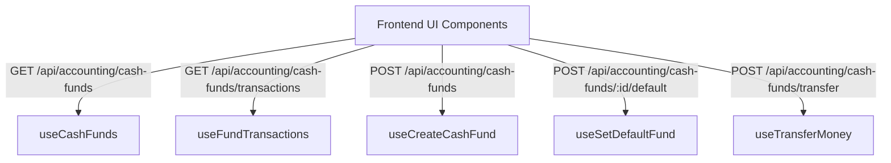

# STAX Sổ Quỹ (Cash Book) — Frontend UI/UX Analysis (Bước 1️⃣)

- **Date:** 2026-05-18
- **Workflow Phase:** Bước 1️⃣: Khởi tạo Context & Phân tích UI/UX
- **Context Checked:** Đã đọc [03_be_walkthrough.md](./03_be_walkthrough.md) để đồng bộ hoàn hảo các APIs hạ tầng.

---

## 1. Mục tiêu UX/UI (Aesthetic & Experience Goals)

Chúng ta sẽ tạo ra một trang Sổ Quỹ (Cash Book) **bứt phá khỏi các khuôn mẫu kế toán khô khan truyền thống**, mang lại sự hứng khởi cho người dùng doanh nghiệp vừa và nhỏ bằng cách kết hợp 2 triết lý thiết kế đỉnh cao:

### A. Modern View (Bento Grid Dashboard) — Phong cách Doanh Chủ Hiện Đại
Trực quan hóa tài chính giúp CEO/Doanh chủ nắm bắt sức khỏe dòng tiền chỉ trong **3 giây**:
*   **Thẻ Tổng số dư Glassmorphism:** Hiển thị tổng tiền mặt, tiền gửi ngân hàng với các hiệu ứng Gradient màu ngọc lục bảo (Emerald) và Sapphire lấp lánh, phản xạ ánh sáng mượt mà.
*   **Bento Grid Layout:** Các block chức năng được sắp xếp linh hoạt:
    *   *Block 1:* Số dư tức thời của từng quỹ (Tiền mặt, ACB, Vietcombank...) thiết kế như các "Thẻ tín dụng tối giản" tuyệt đẹp.
    *   *Block 2:* Biểu đồ tỷ trọng cơ cấu dòng tiền (Donut Chart) trực quan hóa tiền mặt vs ngân hàng.
    *   *Block 3:* Lối tắt hành động nhanh (Quick Action) như "Chuyển tiền nội bộ" và "Tạo quỹ mới" với hiệu ứng Micro-animations khi Hover.

### B. Classic View (Accounting Ledger) — Phong cách Kế toán Chuyên nghiệp
Cung cấp công cụ đối chiếu và kiểm toán dòng tiền chuẩn chỉ, chính xác tuyệt đối:
*   **Bảng Sổ Nhật ký dòng tiền (Ledger Table):** Thiết kế tối giản tinh tế (Clean Typography, Muted Borders).
*   **Bộ lọc nâng cao (Advanced Filter Bar):** Lọc theo Sổ quỹ cụ thể, và Khoảng ngày (StartDate - EndDate) với DateRangePicker mượt mà.
*   **Cột Số dư lũy tiến (Running Balance):** Mỗi dòng giao dịch thu/chi đều hiển thị số dư quỹ thay đổi tương ứng tại thời điểm đó để kế toán dễ dàng đối chiếu số liệu.
*   **Responsive DataGrid:** Bọc trong container `overflow-x-auto scrollbar-thin` đảm bảo vuốt ngang cực mượt trên các thiết bị di động.

---

## 2. Hệ thống REST Endpoints & Data Flow

Dữ liệu sẽ được đồng bộ chặt chẽ với Backend thông qua các endpoints đã được kiểm thử:

### Các API Endpoints tích hợp:
1.  `GET /api/accounting/cash-funds`: Lấy danh sách Sổ quỹ.
2.  `POST /api/accounting/cash-funds`: Tạo Sổ quỹ mới.
3.  `POST /api/accounting/cash-funds/:id/default`: Thiết lập Sổ quỹ làm mặc định.
4.  `POST /api/accounting/cash-funds/transfer`: Chuyển tiền nội bộ giữa các quỹ.
5.  `GET /api/accounting/cash-funds/transactions`: Lấy danh sách giao dịch dòng tiền (hỗ trợ các bộ lọc phân trang `page`, `limit`, `fundId`, `startDate`, `endDate`).

---

## 3. Server-Driven UI Logic (`_actions`)

Để đảm bảo phân quyền chặt chẽ theo Hiến pháp STAX:
*   Nút "Chuyển tiền nội bộ" và "Cài đặt mặc định" sẽ tự động ẩn/hiện hoặc chuyển sang trạng thái Disabled dựa trên trường `canManage` trả về từ API danh sách Sổ quỹ.
*   Các nút thao tác thu/chi trực tiếp trên từng quỹ được điều khiển bởi quyền hạn module Kế toán (`finote:write`).

---

## 4. Kế hoạch Tích hợp Trải nghiệm
1.  **`RecordPaymentDialog.tsx`:** Bổ sung Select Box để người dùng chọn Sổ quỹ khi tiến hành thu/chi tiền cho hóa đơn Finote.
2.  **`CashBookPage.tsx`:** Trang chính chứa 2 Tabs (Modern & Classic), tự động chuyển đổi giao diện mượt mà bằng CSS Transitions.
3.  **`TransferMoneyDialog.tsx`:** Form chuyển khoản giữa các quỹ kế thừa `react-hook-form` + `zodResolver` và có cơ chế cảnh báo nếu số tiền chuyển lớn hơn số dư hiện tại của quỹ gửi.

---

Vui lòng gõ 'OK' để tôi tiến hành thiết kế kiến trúc FE.
